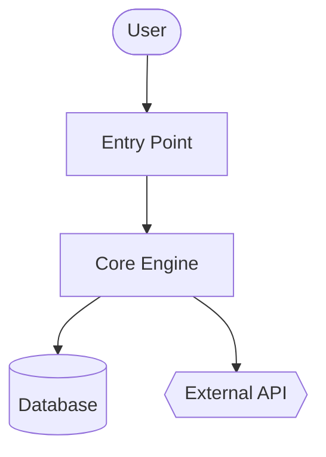
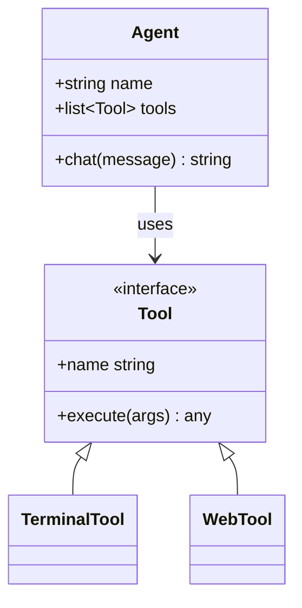
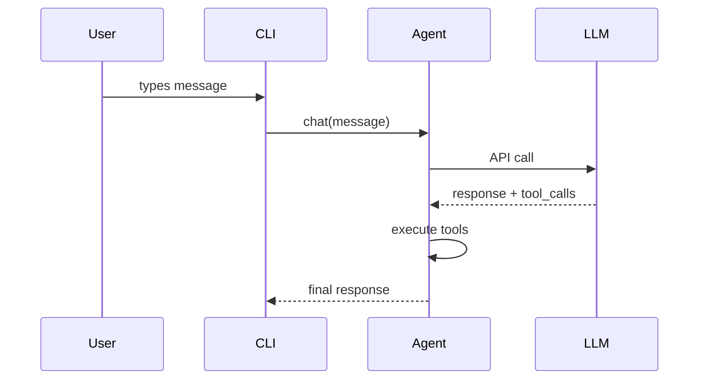

# Code Wiki — Output Templates

Exact markdown templates for each generated file. Read this when you're at
the corresponding step in SKILL.md's Procedure and need the literal
structure to write.

## README.md (Step 4)

`read_file` the actual project README plus the top 2–3 entry-point files. Then `write_file`:

````markdown
# <Project Name>

<One paragraph: what it is and what it's for. Self-contained — don't assume the
reader has the source README.>

## Key Concepts

- **<Concept 1>** — <one line>
- **<Concept 2>** — <one line>

## Entry Points

- [`path/to/main.py`](<link>) — <what runs when you start it>
- [`path/to/cli.py`](<link>) — <CLI surface>

## High-Level Architecture

<2-3 sentences. Detail goes in architecture.md.>

See [architecture.md](architecture.md).

## Module Map

| Module | Purpose |
|---|---|
| [`<module>`](modules/<module>.md) | <one-line purpose> |

## Getting Started

See [getting-started.md](getting-started.md).
````

For link targets in local mode use relative paths. For cloned repos use `https://github.com/<owner>/<repo>/blob/<sha>/<path>` so links survive future commits.

## architecture.md (Step 5)

````markdown
# Architecture

<2-3 paragraphs: shape of the system. What talks to what. Where data enters,
where it exits, where state lives.>

## Components

- **<Component>** — <1-2 sentences>. See [`modules/<module>.md`](modules/<module>.md).

## System Diagram



## Data Flow

1. **<Step>** — [`<file>`](<link>)
2. **<Step>** — [`<file>`](<link>)

## Key Design Decisions

- <Anything load-bearing the reader should know>
````

**Mermaid shape semantics:**
- `[]` = component
- `[()]` = database / storage
- `{{}}` = external service
- `(())` = entry point or terminal
- `-->` = sync call, `-.->` = async/event

Cap at ~20 nodes per diagram. Split into sub-diagrams if larger.

## modules/<module>.md (Step 6)

For each selected module, inspect its layout with `ls`, identify 3–5 most important files (by size, by being named `core.py` / `main.py` / `__init__.py`, by being imported a lot), then `read_file` those files (use `offset` / `limit` to read only what you need; prefer `search_files` for specific symbols).

````markdown
# Module: `<module>`

<1-2 sentence purpose.>

## Responsibilities

- <bullet>
- <bullet>

## Key Files

- [`<module>/<file>`](<link>) — <what it does>

## Public API

<Functions/classes/constants other code uses. Group related items. Show
signatures, not full implementations.>

## Internal Structure

<How the module is organized internally. State management.>

## Dependencies

- **Used by:** <other modules>
- **Uses:** <other modules + external libs>

## Notable Patterns / Gotchas

- <Anything non-obvious>
````

## diagrams/class-diagram.md (Step 7)

Pick the 5–10 most important classes/types. `read_file` them, then write:

````markdown
# Class Diagram

## Core Types



## Notes

<Anything the diagram can't express — lifecycle, threading, etc.>
````

For languages without classes (Go, C, Rust): use the diagram for struct relationships, or skip class-diagram.md and explain it in prose in architecture.md. Don't force-fit.

## diagrams/sequences.md (Step 8)

Pick 2–4 of the most important workflows. Trace each call path through the code (read entry point, follow function calls), then:

````markdown
# Sequence Diagrams

## Workflow: <Name>

<1 sentence describing what this does and when it runs.>



### Walkthrough

1. **User input** — [`cli.py:HermesCLI.run_session`](<link>)
2. **Message dispatch** — [`run_agent.py:AIAgent.chat`](<link>)
````

Don't invent participants. Every box must correspond to a real component the reader can find in the code.

## getting-started.md (Step 9)

````markdown
# Getting Started

## Prerequisites

<From manifest files + README. Be specific — versions if pinned.>

## Installation

```bash
<exact commands>
```

## First Run

```bash
<minimum command to see the system do something useful>
```

## Common Workflows

### <Workflow 1>
<commands>

## Configuration

- `<config-file>` — <what it controls>
- Env var `<VAR>` — <what it controls>

## Where to Go Next

- Architecture: [architecture.md](architecture.md)
- Module reference: [README.md#module-map](README.md#module-map)
````

## api.md (Step 10, skip if not applicable)

Only write this if the project is a library or API server. If it is:

- Find the public API surface (`__init__.py` exports, OpenAPI specs, route handlers, exported types)
- Document each public entry with signature, parameters, return type, one-line description
- Group by category
